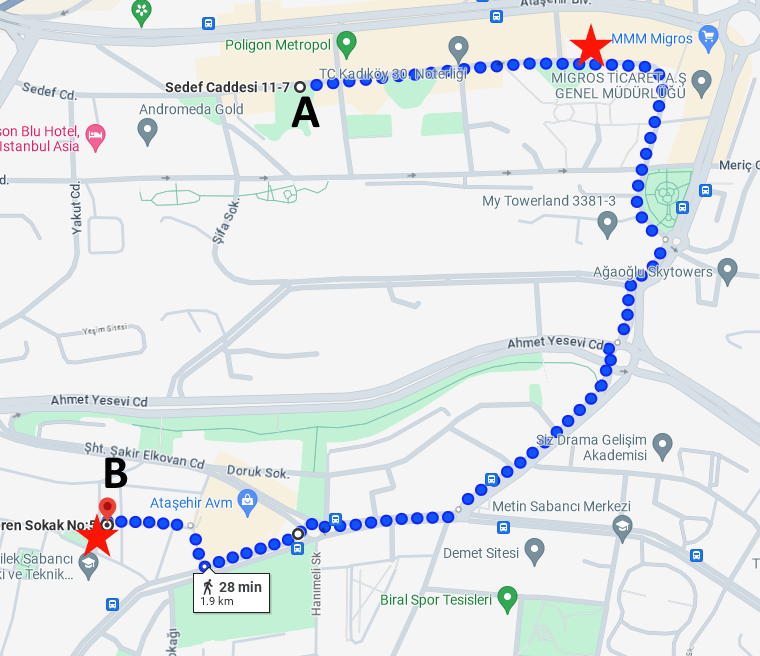
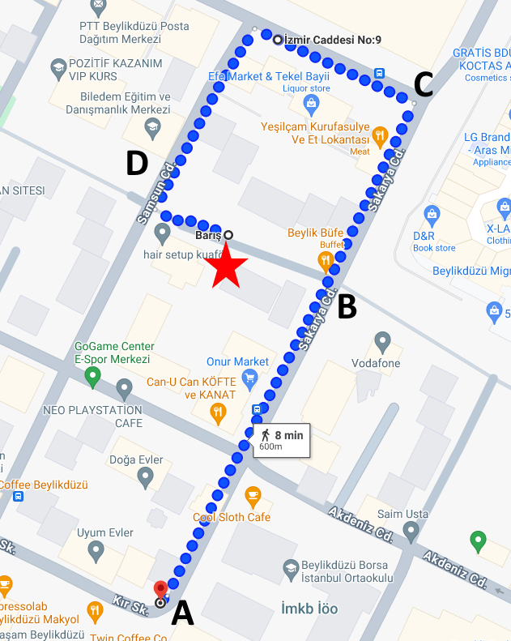

# Courier Tracking
- Java 17
- Spring Boot 3.2.3
- H2 Database
- Slf4j

Swagger: http://localhost:8089/swagger-ui/index.html
***
## Test Scripts
### Test 1

[src/main/resources/static/test-01.sh](https://github.com/atifimal/courier-track/blob/6381100a9c066e31f4105622737e0a463e819063/src/main/resources/static/test-01.sh)

Prepared test data, 33 lat lng points, starts from point A to B  
Red star shows market stores. 

`Point A` is far away from store more than 100 meter, courier enters store, than travels at the speed of light and reach second store near `Point B`.  

(To test entering another store in less than 1 minute)

 

### Test 2

[src/main/resources/static/test-02.sh](https://github.com/atifimal/courier-track/blob/6381100a9c066e31f4105622737e0a463e819063/src/main/resources/static/test-02.sh)

Prepared test data, 15 lat lng points, starts from `Point A` to `Point D`  
Red star show market store.

`Point A` is far away from store more than 100 meter, courier enters 100 meter radius of store at `Point B`, than reaches `Point C` which is out of 100 meter radius, than reaches `Point D` enters radius again, all happens in less than 1 minute. 

(To test reentering same store in less than 1 minute)

 

### Test 3

[src/main/resources/static/test-03.sh](https://github.com/atifimal/courier-track/blob/6381100a9c066e31f4105622737e0a463e819063/src/main/resources/static/test-03.sh)

Same road with Test 2, the only difference is courier's waiting 61 seconds between `Point C` and `Point D`.

(To test reentering same store after more than 1 minute)

***

**PS:** Needed to add parallel request limit in scripts when applying curl in loops.